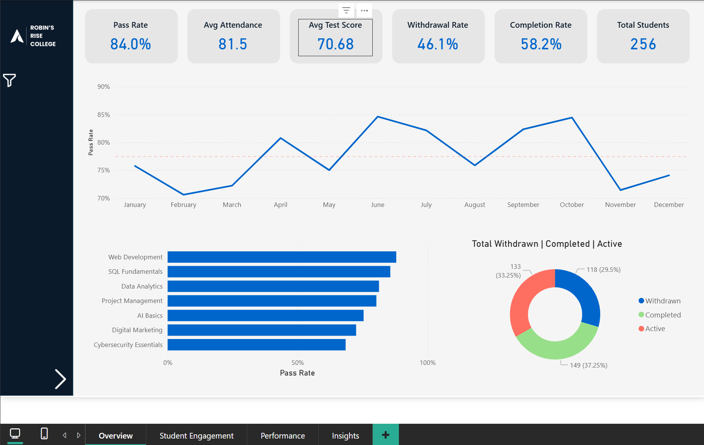
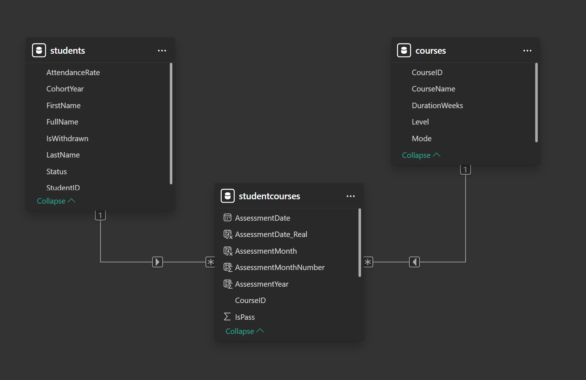
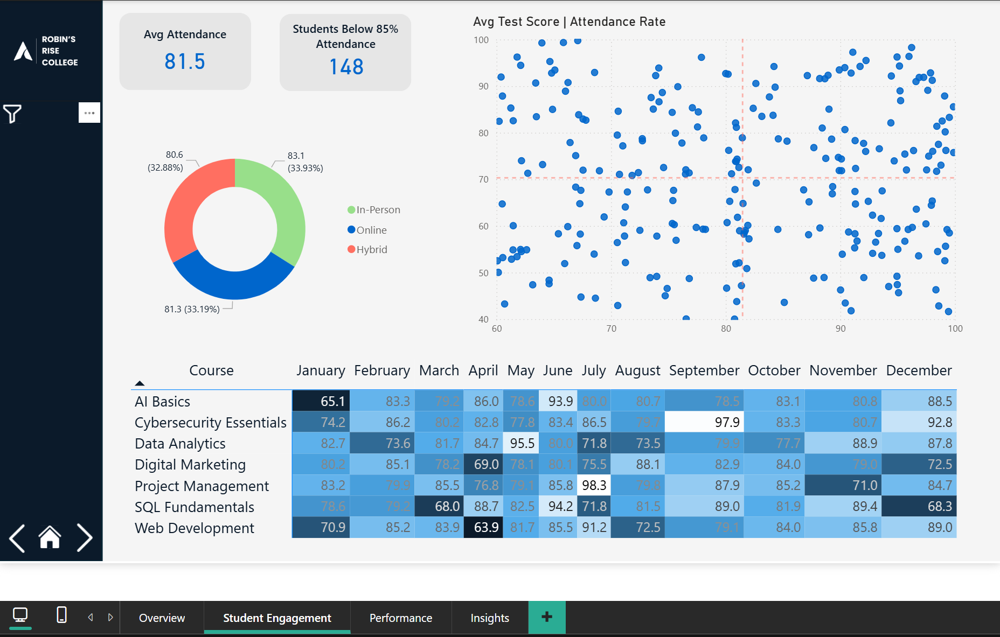
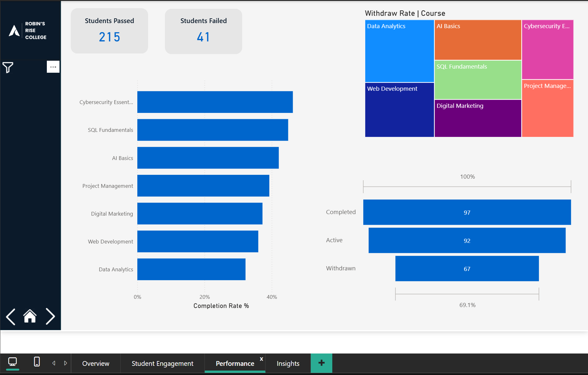
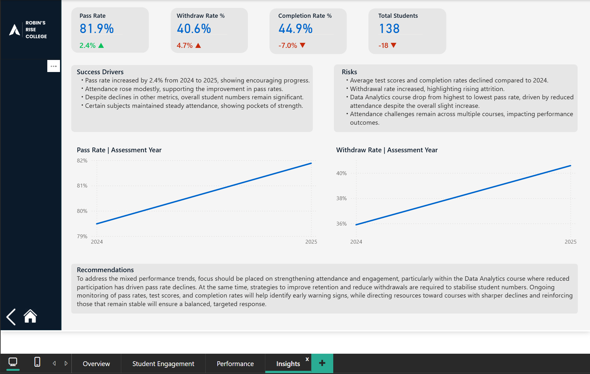

<h>🎓 College Performance & Student Success Dashboard </h>

<h2>Power BI | Data Analytics Portfolio Project.</h2>

<h3>📌 Project Overview</h3>

This project presents an end-to-end data analytics and Power BI reporting solution for analysing student success at a fictional institution, Robin’s Rise College.

The dashboard is designed to support academic leadership and operational decision-making by providing visibility into student performance, attendance, withdrawals, and completions. It follows a structured data storytelling approach, progressing from a high-level overview to diagnostic analysis and actionable recommendations.

🎯 Project Objectives

Provide an executive-level snapshot of student success and outcomes

Identify trends and changes in performance and attendance over time

Understand drivers behind withdrawals and completions

Highlight risk areas and stable performers

Demonstrate practical skills in Power BI, DAX, data modelling, and data storytelling

❓ Business Questions Answered

How is the college performing overall in terms of pass rates and completion?

Are student outcomes improving or declining year-on-year?

What relationship exists between attendance and academic success?

Which courses or departments are driving success, and which present risk?

Where should leadership focus intervention efforts to improve retention?

How can data be used to identify early warning signs of withdrawal?

<h3>Data Model</h3>

📊 Dashboard Structure & Narrative Flow
Page 1 — Overview

Purpose:
Provide a high-level snapshot of overall student success.

Key Features:

KPI cards:

Pass Rate

Average Attendance

Average Test Score

Withdrawal Rate

Completion Rate

Total Students

Monthly pass rate trend line as the primary narrative anchor

Pass rate by department bar chart

Student status distribution (Withdrawn vs Completed vs Active) using a donut chart

Dynamic year slicer

*Overview Page with dynamic slicer panel

  

Page 2 — Student Engagement & Attendance

Purpose:
Explain why success rates look the way they do by analysing engagement patterns.

Analysis Includes:

Overall attendance rate

Identification of low-attendance students (<85%)

Attendance trends across the academic year

Relationship between attendance and performance

Department-level attendance comparisons

Page 3 — Performance, Achievement & Withdrawals

Purpose:
Drill deeper into performance outcomes and identify withdrawal drivers.

Analysis Includes:

Pass rates and average test scores by department

Comparison of high vs low performers

Withdrawal and completion rates by course

Funnel-style view of the student journey:

Enrolled → Active → Completed / Withdrawn

Page 4 — Insights & Recommendations

Purpose:
Translate analysis into clear, actionable insights for decision-makers.

Includes:

KPI trend summary

Key success drivers

Identified risks

Data-backed recommendations

Final comparison of early vs late academic year trends

🔍 Key Insights Discovered
Success Drivers

Pass rate increased by 2.4% from 2024 to 2025, indicating encouraging progress in academic outcomes.

Attendance rose modestly year-on-year, supporting improvements in pass rates and reinforcing attendance as a success driver.

Overall, student numbers remain significant, providing stability despite mixed performance trends.

Certain subjects maintained steady attendance, highlighting pockets of strength and effective course delivery.

Risks & Areas of Concern

Average test scores declined compared to 2024, suggesting potential gaps in assessment readiness or knowledge retention.

Completion rates fell while withdrawal rates increased, highlighting rising attrition and potential funding risk.

The Data Analytics course dropped from the highest to the lowest pass rate, driven by reduced attendance despite a slight overall attendance increase.

Attendance challenges persist across multiple courses, negatively impacting both performance and completion outcomes.

📌 Recommendations

To address the mixed performance trends, focus should be placed on strengthening attendance and student engagement, particularly within the Data Analytics course, where reduced participation has directly contributed to declining pass rates.

At the same time, targeted retention strategies are required to reduce withdrawals and stabilise student numbers. This may include early-intervention support for low-attendance students, improved engagement tracking, and course-level reviews where declines are most pronounced.

Ongoing monitoring of pass rates, test scores, attendance, and completion rates will help identify early warning signs. Directing resources toward courses with sharper declines while reinforcing approaches used by stable, high-performing subjects will support a balanced and data-driven response to improving student success.

🛠 Tools & Skills Demonstrated

Power BI

Data modelling

DAX measures (KPIs, rates, percentages)

Interactive dashboards and slicers

Data Analysis

Trend and year-on-year analysis

Performance benchmarking

Funnel and retention analysis

Data Storytelling

Structured narrative using executive-focused reporting

Visual Design

Consistent branding and layout

Clear hierarchy and readability
